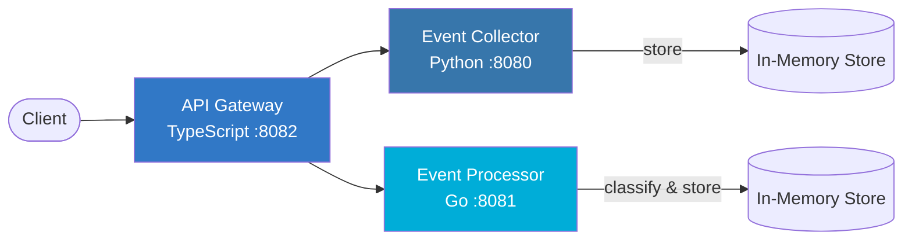

# StreamPulse

Real-time event analytics platform built with a microservices architecture. Collect, process, and analyze user events through a unified API gateway.

## Architecture



### Services

| Service | Language | Port | Description |
|---------|----------|------|-------------|
| **API Gateway** | TypeScript (Express) | 8082 | Unified entry point, request routing, error handling |
| **Event Collector** | Python (Flask) | 8080 | Event ingestion, storage, querying, and statistics |
| **Event Processor** | Go (net/http) | 8081 | Event classification, labeling, and enrichment |

### Event Flow

1. Client sends an event to the API Gateway (`POST /api/v1/events`)
2. Gateway forwards to Event Collector for storage
3. Gateway forwards to Event Processor for classification
4. Processor labels events by category (engagement, interaction, conversion, error) and priority (low, medium, high, critical)

## Quick Start

### Prerequisites

- Docker & Docker Compose
- Or for local development: Python 3.12+, Go 1.22+, Node.js 20+

### Using Docker Compose

```bash
# Copy environment config
cp .env.example .env

# Start all services
make up

# Check status
make status

# View logs
make logs

# Stop services
make down
```

### Local Development

```bash
# Run all tests
make test

# Run linters
make lint

# Run individual service tests
make test-python
make test-go
make test-ts
```

## API Reference

All endpoints are available through the API Gateway at `http://localhost:8082`.

### Health Check

```
GET /health
```

Response:
```json
{
  "status": "healthy",
  "service": "api-gateway",
  "timestamp": "2026-01-01T00:00:00.000Z",
  "upstreams": {
    "collector": "http://event-collector:8080",
    "processor": "http://event-processor:8081"
  }
}
```

### Ingest Event

```
POST /api/v1/events
Content-Type: application/json

{
  "event_type": "purchase",
  "payload": { "amount": 49.99, "product_id": "SKU-123" },
  "source": "web"
}
```

Response (`201`):
```json
{
  "message": "Event ingested",
  "event_id": "550e8400-e29b-41d4-a716-446655440000"
}
```

### List Events

```
GET /api/v1/events?event_type=purchase&limit=50
```

### Event Statistics

```
GET /api/v1/events/stats
```

Response:
```json
{
  "total_events": 142,
  "by_type": {
    "page_view": 80,
    "click": 35,
    "purchase": 27
  }
}
```

### Processed Events

```
GET /api/v1/processed
```

## Usage Examples

```bash
# Send an event
curl -X POST http://localhost:8082/api/v1/events \
  -H "Content-Type: application/json" \
  -d '{"event_type": "page_view", "payload": {"url": "/home"}, "source": "web"}'

# Get event stats
curl http://localhost:8082/api/v1/events/stats

# Get processed events with labels
curl http://localhost:8082/api/v1/processed

# Health check
curl http://localhost:8082/health
```

## Environment Variables

| Variable | Default | Description |
|----------|---------|-------------|
| `COLLECTOR_PORT` | `8080` | Event Collector exposed port |
| `PROCESSOR_PORT` | `8081` | Event Processor exposed port |
| `GATEWAY_PORT` | `8082` | API Gateway exposed port |
| `LOG_LEVEL` | `info` | Log verbosity (debug, info, warn, error) |
| `FLASK_DEBUG` | `false` | Enable Flask debug mode |

## CI/CD

GitHub Actions workflow runs on push/PR to `main`:

1. **test-python** — flake8 lint + pytest
2. **test-go** — go vet + go test
3. **test-typescript** — eslint + jest
4. **docker-build** — validates Docker Compose build (after all tests pass)

> **Note:** The `.github/workflows/ci.yml` file may need to be manually added after the initial merge due to GitHub API restrictions on the `.github/` directory.

### CI Workflow Content

```yaml
name: CI

on:
  push:
    branches: [main]
  pull_request:
    branches: [main]

jobs:
  test-python:
    runs-on: ubuntu-latest
    defaults:
      run:
        working-directory: event-collector
    steps:
      - uses: actions/checkout@v4
      - uses: actions/setup-python@v5
        with:
          python-version: "3.12"
      - run: pip install -r requirements.txt
      - run: flake8 --max-line-length=120 app.py
      - run: pytest -v --tb=short

  test-go:
    runs-on: ubuntu-latest
    defaults:
      run:
        working-directory: event-processor
    steps:
      - uses: actions/checkout@v4
      - uses: actions/setup-go@v5
        with:
          go-version: "1.22"
      - run: go vet ./...
      - run: go test -v ./...

  test-typescript:
    runs-on: ubuntu-latest
    defaults:
      run:
        working-directory: api-gateway
    steps:
      - uses: actions/checkout@v4
      - uses: actions/setup-node@v4
        with:
          node-version: "20"
      - run: npm ci
      - run: npx eslint src/
      - run: npm test

  docker-build:
    runs-on: ubuntu-latest
    needs: [test-python, test-go, test-typescript]
    steps:
      - uses: actions/checkout@v4
      - run: docker compose build
```

## License

MIT
